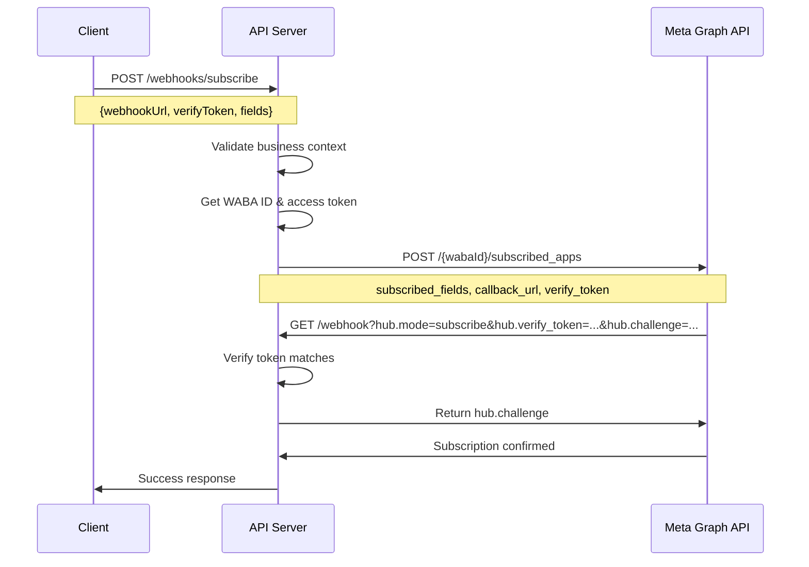
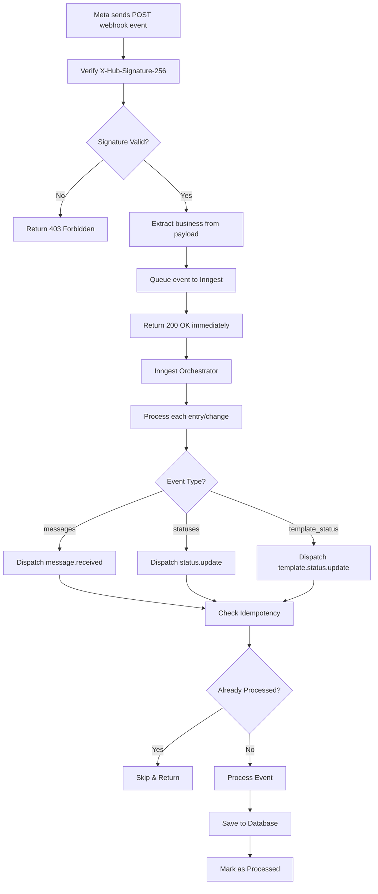

# Webhook Subscription Architecture

## Overview
This document explains how webhook subscriptions work in the LeMenu API server for Meta/WhatsApp Business API integration.

## 1. Webhook Subscription Endpoints

### Management Endpoints (Authenticated)
Located in [metaWhatsAppRoute.ts:93-96](src/routes/metaWhatsAppRoute.ts#L93-L96)

```
GET    /api/v1/whatsapp/webhooks/subscriptions          - Get current webhook subscriptions
POST   /api/v1/whatsapp/webhooks/subscribe              - Create new webhook subscription
PUT    /api/v1/whatsapp/webhooks/subscriptions          - Update webhook subscription fields
DELETE /api/v1/whatsapp/webhooks/subscriptions/:appId   - Remove webhook subscription
```

### Event Receiver Endpoints (Public - No Auth)
Located in [metaWhatsAppRoute.ts:102-103](src/routes/metaWhatsAppRoute.ts#L102-L103)

```
GET    /api/v1/whatsapp/webhook    - Webhook verification (Meta calls this to validate)
POST   /api/v1/whatsapp/webhook    - Receive webhook events (Meta sends events here)
```

## 2. Subscription Flow

### Initial Setup



### Step-by-Step Process

**1. Client Initiates Subscription**
```javascript
POST /api/v1/whatsapp/webhooks/subscribe
Authorization: Bearer <JWT_TOKEN>

{
  "webhookUrl": "https://api.example.com/api/v1/whatsapp/webhook",
  "verifyToken": "my_secret_verify_token",
  "fields": ["messages", "message_template_status_update"]
}
```

**2. Controller Validation** ([metaWhatsAppController.ts](src/controllers/metaWhatsAppController.ts))
- Extracts business context from request (subDomain, localId)
- Validates required fields
- Retrieves business configuration

**3. Service Call to Meta API** ([metaWhatsAppService.ts](src/services/whatsapp/metaWhatsAppService.ts))
```javascript
POST https://graph.facebook.com/v22.0/{wabaId}/subscribed_apps

{
  "subscribed_fields": ["messages", "statuses"],
  "callback_url": "https://api.example.com/api/v1/whatsapp/webhook",
  "verify_token": "my_secret_verify_token"
}
```

**4. Meta Verification Callback**
Meta immediately calls your webhook endpoint to verify ownership:
```
GET https://api.example.com/api/v1/whatsapp/webhook
    ?hub.mode=subscribe
    &hub.verify_token=my_secret_verify_token
    &hub.challenge=1234567890
```

**5. Webhook Handler Response** ([metaWhatsAppController.ts:1439](src/controllers/metaWhatsAppController.ts#L1439))
```javascript
if (mode === 'subscribe' && token === process.env.WHATSAPP_WEBHOOK_VERIFY_TOKEN) {
  return res.status(200).send(challenge);  // Return the challenge string
}
```

**6. Subscription Confirmed**
If verification succeeds, Meta confirms the subscription and begins sending events.

## 3. Event Processing Flow

### Webhook Event Reception



### Security: Signature Verification

Located in [metaWhatsAppController.ts:1539-1580](src/controllers/metaWhatsAppController.ts#L1539-L1580)

```javascript
function verifyWebhookSignature(rawBody, signature, secret) {
  // Extract signature from header
  const signatureHash = signature.replace('sha256=', '');

  // Compute HMAC-SHA256
  const expectedHash = crypto
    .createHmac('sha256', secret)
    .update(rawBody)
    .digest('hex');

  // Timing-safe comparison (prevents timing attacks)
  return crypto.timingSafeEqual(
    Buffer.from(signatureHash),
    Buffer.from(expectedHash)
  );
}
```

### Business Identification

Located in [metaWhatsAppWebhookService.ts](src/services/whatsapp/metaWhatsAppWebhookService.ts)

The system uses multiple strategies to identify which business owns the webhook:

1. **Phone Number ID** (Primary):
   ```javascript
   value.metadata.phone_number_id → "123456789"
   Business.findOne({ whatsappPhoneNumberIds: "123456789" })
   ```

2. **Entry ID Parsing** (Fallback):
   ```javascript
   entry.id → "WABA_ID-PHONE_NUMBER_ID"
   Parse and extract phone number ID
   ```

3. **WABA ID** (Last Resort):
   ```javascript
   value.metadata.waba_id → "987654321"
   Business.findOne({ wabaId: "987654321" })
   ```

## 4. Async Processing with Inngest

### Why Async Processing?

1. **Fast Response**: Return 200 OK to Meta immediately (prevents retries)
2. **Scalability**: Handle high volumes without blocking
3. **Reliability**: Automatic retries on failures
4. **Orchestration**: Process complex multi-step workflows

### Event Flow

Located in [inngestService.ts:640-737](src/services/inngestService.ts#L640-L737)

```javascript
// Main orchestrator function
inngest.createFunction(
  { id: 'process-whatsapp-webhook-entry' },
  { event: 'whatsapp/webhook.entry' },
  async ({ event, step }) => {
    // Step 1: Extract business info
    const business = await step.run('extract-business', async () => {
      return extractBusinessFromWebhook(event.data.entry);
    });

    // Step 2: Process each change
    for (const change of entry.changes) {
      if (change.field === 'messages') {
        // Dispatch message events
        for (const message of change.value.messages) {
          await step.sendEvent('dispatch-message', {
            name: 'whatsapp/message.received',
            data: { message, business }
          });
        }

        // Dispatch status events
        for (const status of change.value.statuses) {
          await step.sendEvent('dispatch-status', {
            name: 'whatsapp/status.update',
            data: { status, business }
          });
        }
      }

      if (change.field === 'message_template_status_update') {
        await step.sendEvent('dispatch-template-status', {
          name: 'whatsapp/template.status.update',
          data: { templateStatus: change.value, business }
        });
      }
    }
  }
);
```

### Concurrency Configuration

```javascript
concurrency: [
  {
    key: 'event.data.entry.id',
    limit: 5  // Process 5 entries concurrently per WABA
  }
]
```

## 5. Event Type Handlers

### A. Incoming Messages

Handler: [metaWhatsAppWebhookService.ts](src/services/whatsapp/metaWhatsAppWebhookService.ts)

```javascript
async function processIncomingMessage(message, business) {
  // 1. Idempotency check
  const eventId = message.id;
  const existing = await WebhookEventIdempotency.findOne({
    eventId,
    eventType: 'message',
    subDomain: business.subDomain
  });

  if (existing) {
    return { skipped: true, reason: 'Already processed' };
  }

  // 2. Extract message details
  const { from, timestamp, type } = message;

  // 3. Create/update customer record
  const customer = await WhatsAppCustomer.findOneAndUpdate(
    { phoneNumber: from, subDomain: business.subDomain },
    { lastInteractionAt: new Date(timestamp * 1000) },
    { upsert: true, new: true }
  );

  // 4. Create/update chat
  const chat = await WhatsAppChat.findOneAndUpdate(
    { phoneNumber: from, subDomain: business.subDomain },
    { lastMessageAt: new Date(timestamp * 1000) },
    { upsert: true, new: true }
  );

  // 5. Save message
  const chatMessage = new ChatMessage({
    messageId: message.id,
    chatId: chat._id,
    from,
    timestamp: new Date(timestamp * 1000),
    type,
    content: extractContent(message),
    direction: 'inbound'
  });
  await chatMessage.save();

  // 6. Mark as processed
  await WebhookEventIdempotency.create({
    eventId,
    eventType: 'message',
    subDomain: business.subDomain,
    processedAt: new Date()
  });

  return { success: true, messageId: message.id };
}
```

**Supported Message Types:**
- `text` - Plain text messages
- `image` - Images with optional caption
- `audio` - Voice messages
- `video` - Video messages
- `document` - PDF, Word, Excel files
- `location` - GPS coordinates
- `contacts` - vCard contact info
- `interactive` - Button/list responses
- `template` - Template message responses

### B. Message Status Updates

Handler: [metaWhatsAppWebhookService.ts](src/services/whatsapp/metaWhatsAppWebhookService.ts)

```javascript
async function processMessageStatus(status, business) {
  const { id: messageId, status: statusType, timestamp } = status;

  // Create unique event ID for status
  const eventId = `${messageId}:${statusType}`;

  // Check idempotency
  const existing = await WebhookEventIdempotency.findOne({
    eventId,
    eventType: 'status',
    subDomain: business.subDomain
  });

  if (existing) return { skipped: true };

  // Update message status
  await ChatMessage.findOneAndUpdate(
    { messageId },
    {
      status: statusType,  // 'sent' | 'delivered' | 'read' | 'failed'
      [`${statusType}At`]: new Date(timestamp * 1000)
    }
  );

  // Mark as processed
  await WebhookEventIdempotency.create({
    eventId,
    eventType: 'status',
    subDomain: business.subDomain,
    processedAt: new Date()
  });

  return { success: true, messageId, status: statusType };
}
```

**Status Flow:**
```
sent → delivered → read
  ↓
failed (if error occurs)
```

### C. Template Status Updates

Handler: [metaWhatsAppWebhookService.ts](src/services/whatsapp/metaWhatsAppWebhookService.ts)

```javascript
async function processTemplateStatus(templateStatus, business) {
  const { message_template_name, event } = templateStatus;

  // Update business template record
  await Business.updateOne(
    {
      subDomain: business.subDomain,
      'whatsappTemplates.name': message_template_name
    },
    {
      $set: {
        'whatsappTemplates.$.status': event,  // 'APPROVED' | 'REJECTED' | 'PENDING'
        'whatsappTemplates.$.updatedAt': new Date()
      }
    }
  );

  return { success: true, template: message_template_name, status: event };
}
```

## 6. Idempotency & Duplicate Prevention

### WebhookEventIdempotency Model

Located in [WhatsApp.ts:982-1018](src/models/WhatsApp.ts#L982-L1018)

```javascript
const WebhookEventIdempotencySchema = new Schema({
  eventId: {
    type: String,
    required: true,
    index: true
  },
  eventType: {
    type: String,
    enum: ['message', 'status', 'template_status'],
    required: true
  },
  subDomain: {
    type: String,
    required: true,
    index: true
  },
  processedAt: {
    type: Date,
    required: true,
    default: Date.now
  }
}, {
  timestamps: true
});

// Compound unique index
WebhookEventIdempotencySchema.index(
  { eventId: 1, eventType: 1, subDomain: 1 },
  { unique: true }
);

// TTL index - auto-delete after 7 days
WebhookEventIdempotencySchema.index(
  { createdAt: 1 },
  { expireAfterSeconds: 604800 }  // 7 days
);
```

### Why 7 Days?

- Meta typically retries failed webhooks for 24-48 hours
- 7 days provides buffer for delayed retries
- TTL index automatically cleans up old records (no manual cleanup needed)
- Prevents database bloat

### Race Condition Handling

```javascript
try {
  await WebhookEventIdempotency.create({
    eventId,
    eventType: 'message',
    subDomain
  });
  // Process event...
} catch (error) {
  if (error.code === 11000) {  // Duplicate key error
    // Already processed by another worker
    return { skipped: true, reason: 'Concurrent processing' };
  }
  throw error;
}
```

## 7. Configuration

### Environment Variables

Required in `.env` file:

```bash
# Webhook verification token (for GET requests)
WHATSAPP_WEBHOOK_VERIFY_TOKEN=your_secret_verify_token

# App secret for signature verification
FACEBOOK_APP_SECRET=your_facebook_app_secret

# Webhook URL (where Meta sends events)
WAHA_WEBHOOK_URL=https://api.example.com/api/v1/whatsapp/webhook

# Optional: Facebook Workplace webhooks
FACEBOOK_WEBHOOK_VERIFY_TOKEN=workplace_verify_token
FACEBOOK_WEBHOOK_SECRET=workplace_webhook_secret
```

### Business Model Fields

Stored in [Business.ts:46-59](src/models/Business.ts#L46-L59)

```javascript
{
  wabaId: String,                      // WhatsApp Business Account ID
  whatsappPhoneNumberIds: [String],    // Array of phone number IDs
  whatsappAccessToken: String,         // Encrypted access token
  whatsappTokenExpiresAt: Date,        // Token expiration
  whatsappRefreshToken: String,        // Encrypted refresh token
  whatsappEnabled: Boolean,            // Enable/disable WhatsApp integration
  whatsappTemplates: [{                // Template tracking
    name: String,
    status: String,
    createdAt: Date,
    approvedAt: Date
  }]
}
```

## 8. Testing Webhooks

### Local Development Setup

1. **Use ngrok for local testing:**
   ```bash
   ngrok http 3000
   # Use ngrok URL: https://abc123.ngrok.io/api/v1/whatsapp/webhook
   ```

2. **Subscribe webhook:**
   ```bash
   curl -X POST http://localhost:3000/api/v1/whatsapp/webhooks/subscribe \
     -H "Authorization: Bearer YOUR_JWT" \
     -H "Content-Type: application/json" \
     -d '{
       "webhookUrl": "https://abc123.ngrok.io/api/v1/whatsapp/webhook",
       "verifyToken": "test_verify_token",
       "fields": ["messages", "message_template_status_update"]
     }'
   ```

3. **Test verification:**
   ```bash
   curl "http://localhost:3000/api/v1/whatsapp/webhook?hub.mode=subscribe&hub.verify_token=test_verify_token&hub.challenge=12345"
   # Should return: 12345
   ```

4. **Send test event:**
   ```bash
   curl -X POST http://localhost:3000/api/v1/whatsapp/webhook \
     -H "Content-Type: application/json" \
     -H "X-Hub-Signature-256: sha256=<computed_signature>" \
     -d @test-webhook-payload.json
   ```

### Monitoring & Debugging

**Check logs:**
```javascript
logger.info('Webhook received', {
  wabaId: entry.id,
  changeCount: entry.changes.length,
  timestamp: entry.time
});
```

**Check idempotency records:**
```javascript
db.webhookeventidempotencies.find({
  subDomain: 'my-business',
  eventType: 'message'
}).sort({ createdAt: -1 }).limit(10)
```

**Check processed messages:**
```javascript
db.chatmessages.find({
  direction: 'inbound',
  createdAt: { $gte: new Date(Date.now() - 3600000) }  // Last hour
}).sort({ createdAt: -1 })
```

## Summary

The webhook subscription architecture provides:

✅ **Secure**: HMAC signature verification, timing-safe comparison
✅ **Reliable**: Idempotency checks, automatic retries via Inngest
✅ **Scalable**: Async processing, concurrent workers
✅ **Maintainable**: Clear separation of concerns, comprehensive logging
✅ **Efficient**: TTL indexes, automatic cleanup, fast lookups

## Key Files Reference

| File | Purpose | Lines |
|------|---------|-------|
| [metaWhatsAppRoute.ts](src/routes/metaWhatsAppRoute.ts) | Webhook routes | 93-103 |
| [metaWhatsAppController.ts](src/controllers/metaWhatsAppController.ts) | Webhook handlers | 1388-1620 |
| [metaWhatsAppService.ts](src/services/whatsapp/metaWhatsAppService.ts) | Meta API calls | - |
| [metaWhatsAppWebhookService.ts](src/services/whatsapp/metaWhatsAppWebhookService.ts) | Event processing | - |
| [inngestService.ts](src/services/inngestService.ts) | Async orchestration | 640-737 |
| [WhatsApp.ts](src/models/WhatsApp.ts) | Idempotency model | 982-1018 |
| [Business.ts](src/models/Business.ts) | Business config | 46-59 |
